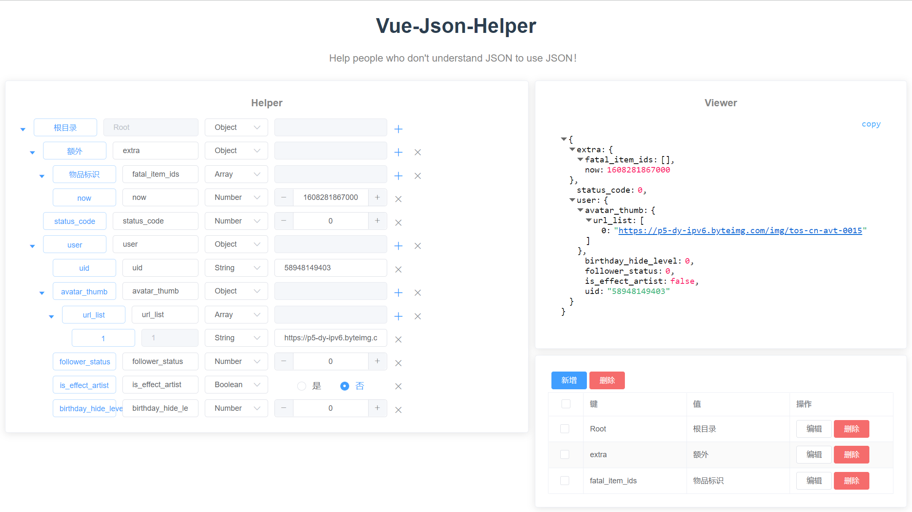

## 在线体验

<br />

文档地址： [https://www.vue-json-helper.com](https://www.vue-json-helper.com)

演示地址： [https://demo.vue-json-helper.com](https://demo.vue-json-helper.com)

<br />




## 创建

&emsp;&emsp;组件库以来vue，如果想使用，请确保在vue环境中，首先创建vue项目，如果直接在项目中使用，请跳过此步骤。

**安装Vue/Cli**

* npm安装

```
npm i -g @vue/cli
```

* 创建Vue项目

```
vue create vue-json-test
```

[Vue/Cli官网](https://cli.vuejs.org/zh/)

## 安装


&emsp;&emsp;在Vue项目下进行组件库安装。

```sh
cd vue-json-test
```

### 1. 安装ElementUI
&emsp;&emsp;项目的组件以来ElementUI，暂没搞明白怎么把ElementUI组件按需打包到自己的组建中，所以安装过程也要安装ElementUI，如果你的项目中包含ElementUI，恭喜你，可以跳过此步骤。

* npm安装

```sh
npm i element-ui -S
```

### 2. 安装VueJsonHelper


* npm安装

```sh
npm install vue-json-helper
```

## 使用

&emsp;&emsp;在 main.js 中写入以下内容：

```js
import Vue from 'vue';
import App from './App.vue';
import ElementUI from 'element-ui';
import VueJsonHelper from 'vue-json-helper'
import 'element-ui/lib/theme-chalk/index.css';

Vue.use(ElementUI);
Vue.use(VueJsonHelper)

new Vue({
  el: '#app',
  render: h => h(App)
});
```

## 用例

* VueJsonHelper说明：<br/>

1. 第一个蓝色标签为节点名，如果再names中配置英文/中文映射，即反馈中文名称。<br/>
2. 第二个输入框为当前节点的键。<br/>
3. 第三个选择框为当前节点的类型，提供String/Number/Boolean/Object/Array类型。<br/>
4. 第四个为当前节点的值，节点类型为Object或Array的不提供输入值。<br/>
5. 当节点类型为Object或者Array时，提供 + 新增子节点，除了Root节点不存在 x 键，其他节点均有 x 键进行删除操作。

## 代码

&emsp;&emsp;当前代码主要展示VueJsonHelper的使用用例。

```javascript
<template>
  <div class="app">
    <VueJsonHelper
      :size="size"
      :names="names"
      :json-str="jsonStr"
      :root-flag="rootFlag"
      :open-flag="openFlag"
      :back-top-flag="backTopFlag"
      @jsonListener="jsonListener"
    />
  </div>
</template>
<script>
export default {
  name: "App",
  data() {
    return {
      size: 'small',
      names: [
        {key: "Root", name: "根节点"},
        {key: "name", name: "姓名"},
        {key: "age", name: "年龄"},
        {key: "flag", name: "标示"},
        {key: "EduexPerience", name: "教育经历"},
        {key: "year", name: "年份"},
        {key: "education", name: "学历"},
      ],
      rootFlag: true,
      openFlag: true,
      backTopFlag: false,
      jsonStr: JSON.stringify({
        name: '张三', 
        age: 16, 
        flag: true, 
        EduexPerience: [
          {year: "2006", education: "高中"},
          {year: "2010", education: "大学"},
        ]}),
    };
  },
  methods: {
    /**监听json数据变化 */
    jsonListener(json) {
      console.log(json);
    },
  },
};
</script>
```
## 参数

| 参数 | 备注 | 类型 | 必填 | 可选值 | 默认值 |
| :-----| :---- | :---- | :---- | :---- | :---- |
| size | 设置组件整体的大小 | String | 否 | mini/small/medium | small |
| names | 设置组件的key对应的中文名称 | Array | 否 | - | - |
| json-str | 设置需要构建的string类型的json | String | 是 | - | - |
| root-flag | 设置是否展示Root根节点 | Boolean | 否 | true/false | true |
| open-flag | 设置是否展开全部节点 | Boolean | 否 | true/false | true |
| back-top-flag | 设置是否展示返回顶点的按钮 | Boolean | 否 | true/false | false |


## 方法

| 事件 | 备注 | 参数 |
| :-----| :---- | :---- |
| jsonListener | json格式或内容改变的监听器，json改变后，将会调用这个方法将最新的json返回。 | json |
